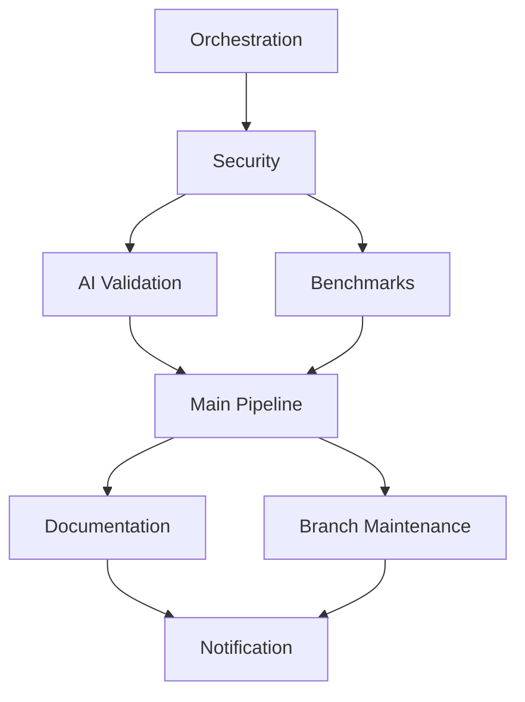

# CI/CD Workflows

This directory contains the GitHub Actions workflows for automated testing, benchmarking, and deployment.

## Workflow Architecture

### 1. Orchestration (`orchestration.yml`)

Central workflow that manages the execution order and dependencies of all other workflows.

#### Flow

1. Security Checks
2. Parallel Execution:
   - AI Model Validation
   - Performance Benchmarks
3. Main CI/CD Pipeline
4. Post-Success Tasks:
   - Documentation Deployment
   - Branch Maintenance

### 2. Security (`security-scan.yml`)

Comprehensive security scanning including:

- CodeQL Analysis
- Dependency Review
- Secret Scanning
- SAST & DAST
- License Compliance

### 3. AI Validation (`ai-validation.yml`)

Validates AI models and ensures ML pipeline integrity:

- Model Performance Testing
- Bias Detection
- Resource Usage Analysis
- Data Pipeline Validation

### 4. Performance (`benchmark.yml`)

Performance testing and benchmarking:

- Memory Usage (4GB limit)
- Load Testing (100 concurrent users)
- Response Time Analysis
- Resource Monitoring

### 5. Main Pipeline (`ci.yml`)

Core CI/CD processes:

- Code Quality Checks
- Unit & Integration Tests
- Coverage Analysis (>80% required)
- Staging & Production Deployment

### 6. Documentation (`docs-deployment.yml`)

Documentation management:

- API Documentation
- User Guides
- Architecture Diagrams
- Changelog Generation

## Environment Configuration

### Required Secrets

- `GITHUB_TOKEN`: Automatically provided
- `SNYK_TOKEN`: For dependency scanning
- `CODECOV_TOKEN`: For coverage reporting
- `DEPLOY_KEY`: For deployment

### Environment Variables

```yaml
CARGO_TERM_COLOR: always
RUST_BACKTRACE: 1
NODE_ENV: production
MEMORY_PROFILER_BATCH_SIZE: 1000
```

## Workflow Dependencies



## Quality Gates

### Code Quality

- Test Coverage: >80%
- Memory Usage: <4GB
- Response Time: <200ms
- Zero Critical Vulnerabilities

### Security

- No Critical CVEs
- No Exposed Secrets
- Clean SAST Scan
- Valid Dependencies

### Performance

- Load Test: 100 users
- Benchmark Regression: <5%
- Memory Leak: None
- CPU Usage: <80%

## Troubleshooting

### Common Issues

1. Memory Usage Tests
   - Error: "Memory limit exceeded"
   - Solution: Adjust `MEMORY_PROFILER_BATCH_SIZE`

2. Security Scans
   - Error: "Failed to analyze"
   - Solution: Update CodeQL queries

3. AI Validation
   - Error: "Model performance degraded"
   - Solution: Check training data

## Contributing

When modifying workflows:

1. Test locally using `act`
2. Update documentation
3. Verify orchestration
4. Test all paths
5. Update dependencies

## Monitoring

Monitor workflow status:

```bash
gh run list
gh run watch
gh pr checks
```

## Support

For issues:

1. Check logs in Actions tab
2. Review error patterns
3. Verify secrets
4. Check dependencies
