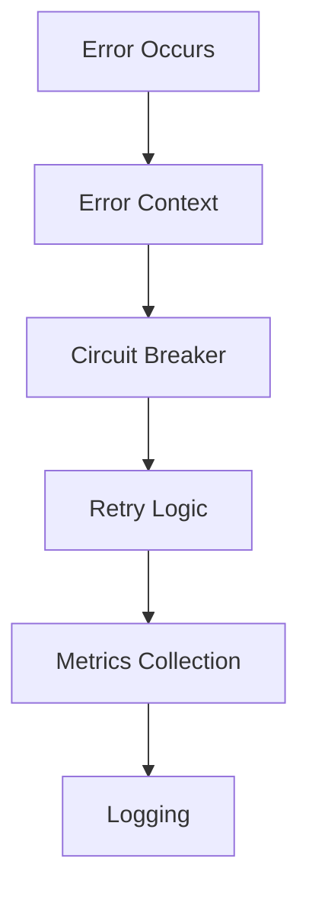

# Anya Core Architecture

## Overview

Anya Core is built on a hexagonal architecture (ports and adapters) pattern, emphasizing clean separation of concerns, domain-driven design, and modularity. The system is designed with security, privacy, and decentralization as core tenets.


## Core Components

### 1. Domain Layer (Core)
- Business logic and rules
- Domain entities and value objects
- Use cases and domain services
- Domain events and handlers
- Error types and handling

### 2. Application Layer (Ports)
#### Input Ports (Primary/Driving)
- Command handlers
- Query handlers
- Event handlers
- API interfaces
- RPC interfaces

#### Output Ports (Secondary/Driven)
- Repository interfaces
- External service interfaces
- Messaging interfaces
- Cache interfaces
- Storage interfaces

### 3. Infrastructure Layer (Adapters)
#### Input Adapters
- REST API controllers
- gRPC handlers
- CLI commands
- WebSocket handlers
- Message consumers

#### Output Adapters
- Database repositories
- External service clients
- Message publishers
- Cache implementations
- File system adapters

## System Architecture

### 1. Bitcoin Integration
- Core Bitcoin functionality with RPC client
- Transaction validation and processing
- Network management and monitoring
- Advanced script validation
- Lightning Network integration
- Multi-signature support

### 2. Error Handling System
```rust
// Comprehensive error handling with context
pub struct ErrorContext {
    error: HexagonalError,
    severity: ErrorSeverity,
    trace_id: Option<String>,
    retry_count: u32,
    metrics: ErrorMetrics
}

// Circuit breaker pattern
pub struct CircuitBreaker {
    state: CircuitState,
    failure_threshold: u32,
    reset_timeout: Duration
}
```

### 3. Metrics & Monitoring
- Real-time performance metrics
- Custom business metrics
- Error and failure metrics
- Resource utilization tracking
- Health check system
- Circuit breaker monitoring

### 4. Security Layer
- Multi-factor authentication
- Role-based access control
- Audit logging
- Encryption at rest
- Secure communication
- HSM integration

### 5. Machine Learning System
- Federated learning
- Model optimization
- Privacy-preserving ML
- Anomaly detection
- Predictive analytics
- Risk assessment

## Component Interaction

### 1. Request Flow


### 2. Error Handling Flow


## Implementation Details

### 1. Domain Layer
```rust
// Core domain types
pub trait DomainService {
    async fn execute(&self, command: Command) -> DomainResult;
}

// Domain events
pub trait DomainEvent {
    fn event_type(&self) -> &str;
    fn occurred_at(&self) -> DateTime<Utc>;
}
```

### 2. Application Layer
```rust
// Input ports
#[async_trait]
pub trait CommandHandler<T> {
    async fn handle(&self, command: T) -> ApplicationResult<()>;
}

// Output ports
#[async_trait]
pub trait Repository<T> {
    async fn save(&self, entity: T) -> RepositoryResult<()>;
    async fn find_by_id(&self, id: &str) -> RepositoryResult<Option<T>>;
}
```

### 3. Infrastructure Layer
```rust
// Input adapter
pub struct RestController {
    command_handler: Arc<dyn CommandHandler>,
    metrics: MetricsCollector
}

// Output adapter
pub struct PostgresRepository {
    pool: PgPool,
    circuit_breaker: CircuitBreaker
}
```

## Error Handling Strategy

### 1. Error Classification
- Domain Errors
- Application Errors
- Infrastructure Errors
- Integration Errors
- Security Errors

### 2. Error Recovery
- Retry Mechanisms
- Circuit Breaker
- Fallback Strategies
- Compensation Actions

### 3. Error Monitoring
- Error Metrics
- Error Patterns
- Recovery Success Rate
- System Health Impact

## Metrics and Monitoring

### 1. Core Metrics
- Transaction throughput
- Error rates and types
- Response times
- Resource utilization
- Cache hit rates

### 2. Business Metrics
- Transaction volumes
- User activity
- Feature usage
- Success rates
- Business KPIs

### 3. ML Metrics
- Model accuracy
- Training performance
- Prediction latency
- Feature importance
- Drift detection

## Security Considerations

### 1. Authentication
- Multi-factor authentication
- Token management
- Session handling
- Identity verification

### 2. Authorization
- Role-based access control
- Permission management
- Policy enforcement
- Access auditing

### 3. Data Protection
- Encryption at rest
- Secure communication
- Key management
- Data anonymization

## Development Guidelines

### 1. Code Organization
- Domain-driven structure
- Clean architecture principles
- SOLID principles
- Dependency injection

### 2. Testing Strategy
- Unit tests
- Integration tests
- Property-based tests
- Performance tests
- Security tests

### 3. Documentation
- API documentation
- Architecture diagrams
- Component interaction
- Error handling
- Security guidelines
