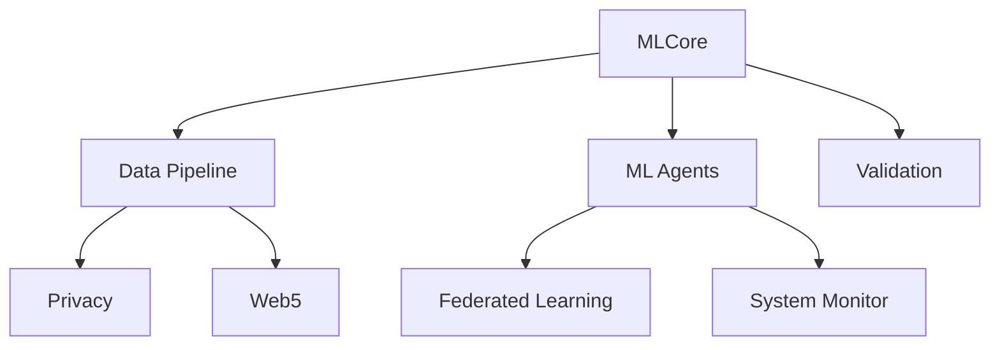
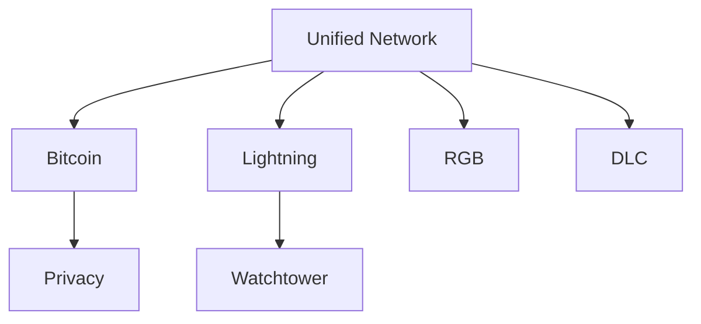
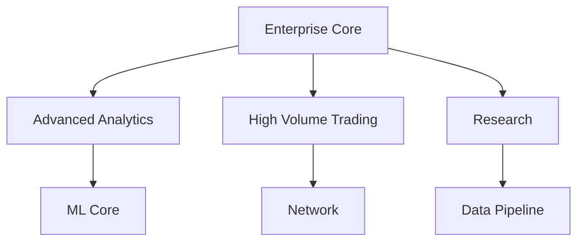

// docs/DEPENDENCIES.md

# System Dependencies

## ML System Dependencies

```mermaid
graph TD
    A[MLCore] --> B[Data Pipeline]
    A --> C[ML Agents]
    A --> D[Validation]
    B --> E[Privacy]
    B --> F[Web5]
    C --> G[Federated Learning]
    C --> H[System Monitor]
```

## Network Dependencies

```mermaid
graph TD
    A[Unified Network] --> B[Bitcoin]
    A --> C[Lightning]
    A --> D[RGB]
    A --> E[DLC]
    B --> F[Privacy]
    C --> G[Watchtower]
```

## Enterprise Dependencies

```mermaid
graph TD
    A[Enterprise Core] --> B[Advanced Analytics]
    A --> C[High Volume Trading]
    A --> D[Research]
    B --> E[ML Core]
    C --> F[Network]
    D --> G[Data Pipeline]
```

*Last updated: 2024-12-07*
