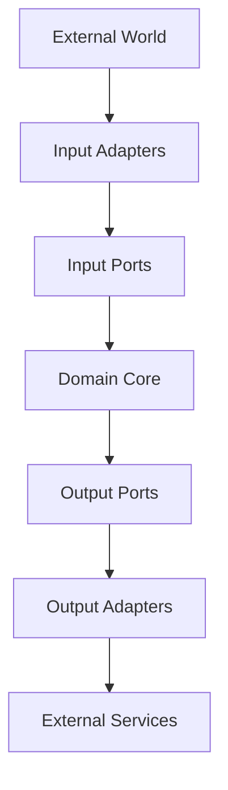

# Hexagonal Architecture Design

## Overview

Our hexagonal architecture implementation follows the ports and adapters pattern to achieve clean separation of concerns and maintainable code. This document details the specific implementation and design decisions.

## Core Principles

### 1. Domain-Centric Design
- Business logic isolated in the domain layer
- No dependencies on external frameworks
- Pure business rules and logic
- Domain-driven design patterns

### 2. Ports and Adapters
- Clear separation between business logic and technical details
- Dependency inversion through interfaces
- Pluggable implementations
- Easy testing and mocking

### 3. Dependency Flow


## Implementation Details

### 1. Domain Layer

```rust
// Core domain entities
pub struct Transaction {
    id: TransactionId,
    amount: Amount,
    status: TransactionStatus,
    metadata: TransactionMetadata,
}

// Domain services
pub trait TransactionService {
    async fn process(&self, tx: Transaction) -> DomainResult<ProcessedTransaction>;
    async fn validate(&self, tx: &Transaction) -> DomainResult<ValidationResult>;
}

// Domain events
pub trait DomainEvent {
    fn event_type(&self) -> &str;
    fn occurred_at(&self) -> DateTime<Utc>;
    fn aggregate_id(&self) -> &str;
}
```

### 2. Application Layer (Ports)

#### Input Ports
```rust
// Command handlers
#[async_trait]
pub trait TransactionHandler {
    async fn handle_create(&self, cmd: CreateTransactionCommand) -> ApplicationResult<TransactionId>;
    async fn handle_process(&self, cmd: ProcessTransactionCommand) -> ApplicationResult<()>;
}

// Query handlers
#[async_trait]
pub trait TransactionQuery {
    async fn get_by_id(&self, id: &TransactionId) -> ApplicationResult<Option<Transaction>>;
    async fn get_by_status(&self, status: TransactionStatus) -> ApplicationResult<Vec<Transaction>>;
}
```

#### Output Ports
```rust
// Repository interfaces
#[async_trait]
pub trait TransactionRepository {
    async fn save(&self, tx: &Transaction) -> RepositoryResult<()>;
    async fn find_by_id(&self, id: &TransactionId) -> RepositoryResult<Option<Transaction>>;
    async fn update_status(&self, id: &TransactionId, status: TransactionStatus) -> RepositoryResult<()>;
}

// External service interfaces
#[async_trait]
pub trait BlockchainService {
    async fn submit_transaction(&self, tx: &Transaction) -> ServiceResult<BlockchainTxId>;
    async fn get_confirmation_status(&self, tx_id: &BlockchainTxId) -> ServiceResult<ConfirmationStatus>;
}
```

### 3. Infrastructure Layer (Adapters)

#### Input Adapters
```rust
// REST API adapter
pub struct TransactionController {
    tx_handler: Arc<dyn TransactionHandler>,
    tx_query: Arc<dyn TransactionQuery>,
}

impl TransactionController {
    async fn create_transaction(&self, req: HttpRequest) -> HttpResponse {
        let cmd = CreateTransactionCommand::from(req);
        match self.tx_handler.handle_create(cmd).await {
            Ok(id) => HttpResponse::Created().json(id),
            Err(e) => e.into_response(),
        }
    }
}

// Message queue adapter
pub struct TransactionMessageConsumer {
    tx_handler: Arc<dyn TransactionHandler>,
}

impl TransactionMessageConsumer {
    async fn handle_message(&self, msg: Message) -> Result<(), ConsumerError> {
        let cmd = ProcessTransactionCommand::from(msg);
        self.tx_handler.handle_process(cmd).await.map_err(Into::into)
    }
}
```

#### Output Adapters
```rust
// Database adapter
pub struct PostgresTransactionRepository {
    pool: PgPool,
    metrics: MetricsCollector,
    circuit_breaker: CircuitBreaker,
}

#[async_trait]
impl TransactionRepository for PostgresTransactionRepository {
    async fn save(&self, tx: &Transaction) -> RepositoryResult<()> {
        let _guard = self.circuit_breaker.guard();
        let result = self.pool.execute(/* SQL query */).await;
        self.metrics.record_operation("save_transaction", &result);
        result.map_err(Into::into)
    }
}

// Blockchain service adapter
pub struct BitcoinServiceAdapter {
    rpc_client: BitcoinRpcClient,
    metrics: MetricsCollector,
}

#[async_trait]
impl BlockchainService for BitcoinServiceAdapter {
    async fn submit_transaction(&self, tx: &Transaction) -> ServiceResult<BlockchainTxId> {
        let btc_tx = self.convert_to_bitcoin_tx(tx);
        self.rpc_client.send_raw_transaction(btc_tx).await.map_err(Into::into)
    }
}
```

## Error Handling

### 1. Layer-Specific Errors
```rust
// Domain errors
#[derive(Error, Debug)]
pub enum DomainError {
    #[error("Invalid transaction: {0}")]
    InvalidTransaction(String),
    #[error("Business rule violation: {0}")]
    BusinessRuleViolation(String),
}

// Application errors
#[derive(Error, Debug)]
pub enum ApplicationError {
    #[error("Command validation failed: {0}")]
    ValidationError(String),
    #[error("Domain error: {0}")]
    DomainError(#[from] DomainError),
}

// Infrastructure errors
#[derive(Error, Debug)]
pub enum InfrastructureError {
    #[error("Database error: {0}")]
    DatabaseError(#[from] sqlx::Error),
    #[error("External service error: {0}")]
    ServiceError(String),
}
```

### 2. Error Context
```rust
pub struct ErrorContext {
    error: Box<dyn Error>,
    layer: ArchitectureLayer,
    severity: ErrorSeverity,
    trace_id: Option<String>,
    retry_info: Option<RetryInfo>,
}
```

## Metrics and Monitoring

### 1. Layer-Specific Metrics
```rust
// Domain metrics
pub struct DomainMetrics {
    business_rule_violations: Counter,
    validation_failures: Counter,
    successful_operations: Counter,
}

// Infrastructure metrics
pub struct InfrastructureMetrics {
    database_operations: Histogram,
    external_service_calls: Histogram,
    cache_hit_rate: Gauge,
}
```

### 2. Cross-Cutting Metrics
```rust
pub struct CrossCuttingMetrics {
    request_duration: Histogram,
    error_count: Counter,
    active_transactions: Gauge,
}
```

## Testing Strategy

### 1. Domain Layer Tests
```rust
#[cfg(test)]
mod tests {
    #[test]
    fn test_transaction_validation() {
        let tx = Transaction::new(/* test data */);
        let service = TransactionService::new();
        let result = service.validate(&tx);
        assert!(result.is_ok());
    }
}
```

### 2. Port Tests
```rust
#[cfg(test)]
mod tests {
    #[tokio::test]
    async fn test_transaction_handler() {
        let handler = MockTransactionHandler::new();
        let cmd = CreateTransactionCommand::new(/* test data */);
        let result = handler.handle_create(cmd).await;
        assert!(result.is_ok());
    }
}
```

### 3. Adapter Tests
```rust
#[cfg(test)]
mod tests {
    #[tokio::test]
    async fn test_postgres_repository() {
        let repo = PostgresTransactionRepository::new(/* test pool */);
        let tx = Transaction::new(/* test data */);
        let result = repo.save(&tx).await;
        assert!(result.is_ok());
    }
}
```

## Configuration

### 1. Dependency Injection
```rust
pub struct ApplicationContext {
    tx_handler: Arc<dyn TransactionHandler>,
    tx_repository: Arc<dyn TransactionRepository>,
    blockchain_service: Arc<dyn BlockchainService>,
}

impl ApplicationContext {
    pub fn new(config: Config) -> Self {
        // Initialize and wire dependencies
    }
}
```

### 2. Feature Flags
```toml
[features]
default = ["postgres", "bitcoin"]
postgres = ["sqlx/postgres"]
bitcoin = ["bitcoin-rpc"]
mock = ["mockall"]
```

## Best Practices

1. **Domain Layer**
   - Keep it pure and framework-independent
   - Use value objects for validation
   - Implement rich domain models
   - Use domain events for side effects

2. **Ports Layer**
   - Define clear interfaces
   - Use async traits
   - Keep ports focused and single-purpose
   - Document expected behavior

3. **Adapters Layer**
   - Implement proper error mapping
   - Include metrics and monitoring
   - Use circuit breakers for external services
   - Implement proper resource cleanup

4. **Testing**
   - Use mocks for ports in unit tests
   - Test adapters against test containers
   - Include performance tests
   - Test error conditions

*Last updated: 2024-12-07*
