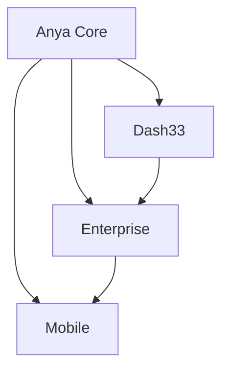

# Architecture Overview

## System Components

### Core Components
1. **Anya Core**
   - AI/ML Processing Engine
   - Blockchain Integration
   - Security Layer

2. **Dash33**
   - Analytics Dashboard
   - Metrics Collection
   - Visualization Engine

3. **Enterprise**
   - Business Logic
   - Integration Layer
   - Compliance Management

4. **Mobile**
   - Cross-platform UI
   - Real-time Updates
   - Secure Storage

## Integration Points

### Internal Integration

### External Integration
- Web5 Protocol
- Bitcoin Network
- Enterprise Systems
- Mobile Platforms

## Security Architecture
- Zero-knowledge Proofs
- Multi-signature Support
- Encryption Layers
- Access Control

## Performance Considerations
- Scalability Design
- Load Distribution
- Caching Strategy
- Optimization Points
