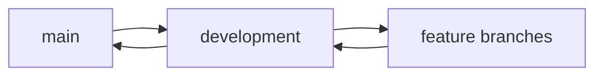

# Development Setup Guide

## Prerequisites

### Required Software

- Rust (latest stable)
- Node.js (16.x or later)
- Python (3.8 or later)
- Docker Desktop

### Development Tools

- VS Code with recommended extensions
- Rust Analyzer
- Git (2.x or later)

## Initial Setup

1. **Clone Repository**

   ```bash
   git clone --recursive https://github.com/botshelomokoka/anya.git
   cd anya
   ```

2. **Install Dependencies**

   ```bash
   # Rust dependencies
   cargo build
   
   # Node.js dependencies
   npm install
   
   # Python dependencies
   pip install -r requirements.txt
   ```

3. **Environment Configuration**

   ```bash
   cp .env.example .env
   # Edit .env with your settings
   ```

## Repository Management

### Repository Structure
```
anya/
├── core/           # Core Anya functionality
├── dash33/         # Dashboard submodule
├── enterprise/     # Enterprise integration
├── mobile/        # Mobile application
└── docs/          # Documentation
```

### Submodule Management
```bash
# Initialize and update all submodules
git submodule update --init --recursive

# Update specific submodule
git submodule update --remote [submodule-name]

# Track submodule branches
git submodule foreach git checkout main
```

### Documentation Tracking
Each repository maintains its own documentation under `docs/`:
- `anya/docs/`: Core documentation
- `dash33/docs/`: Dashboard-specific docs
- `enterprise/docs/`: Enterprise integration docs
- `mobile/docs/`: Mobile application docs

To maintain consistency:
1. Use relative links between docs
2. Follow the standard structure
3. Update cross-repository references

## Development Workflow

### Branch Management



### Testing

1. Unit Tests

   ```bash
   cargo test
   ```

2. Integration Tests

   ```bash
   cargo test --test '*'
   ```

3. End-to-End Tests

   ```bash
   ./scripts/e2e-tests.sh
   ```

## Deployment

### Local Development

```bash
cargo run
```

### Production Build

```bash
cargo build --release
```

## Troubleshooting

### Common Issues

1. Submodule initialization
2. Dependency conflicts
3. Environment configuration

### Support

- GitHub Issues
- Development Chat
- Documentation
