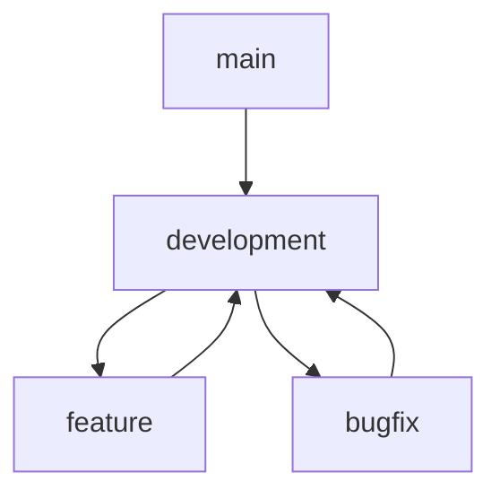

# Contributing Guide

## Code of Conduct

### Our Pledge
We are committed to providing a welcoming and inclusive environment for all contributors.

### Our Standards
- Respectful communication
- Constructive feedback
- Professional conduct
- Inclusive language

## Getting Started

### Prerequisites
1. Git basics
2. Rust knowledge
3. Development environment
4. Testing framework

### Setup Process
1. Fork repository
2. Clone locally
3. Install dependencies
4. Configure environment

## Development Process

### Branching Strategy


### Commit Guidelines
- Clear messages
- Single responsibility
- Reference issues
- Sign commits

### Pull Requests
1. Create branch
2. Make changes
3. Write tests
4. Update docs
5. Submit PR

## Testing

### Requirements
- Unit tests
- Integration tests
- Documentation tests
- Performance tests

### Running Tests
```bash
cargo test
cargo test --doc
cargo bench
```

## Documentation

### Standards
- Clear writing
- Code examples
- API documentation
- Architecture notes

### Generation
```bash
cargo doc
mdbook build
```

## Review Process

### Criteria
- Code quality
- Test coverage
- Documentation
- Performance

### Timeline
- Initial review: 2 days
- Updates: 1 day
- Final review: 1 day

## Release Process

### Versioning
- Semantic versioning
- Change logs
- Release notes
- Migration guides

### Deployment
- Stage changes
- Run tests
- Deploy release
- Monitor status
