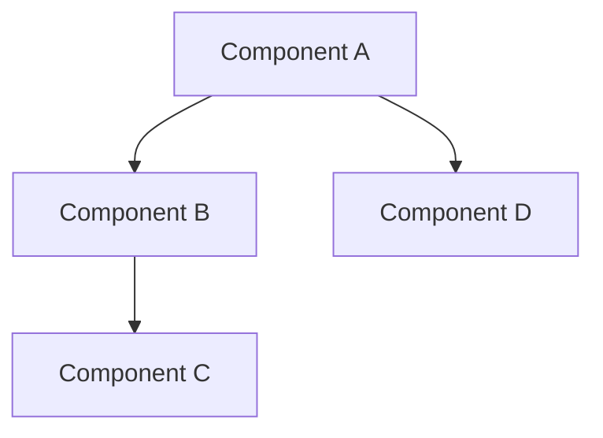

# Module Documentation Template

## Overview

Brief description of the module's purpose and functionality.

## Architecture

### Components

Describe the main components and their relationships:



### Key Concepts

- Concept 1: Description
- Concept 2: Description

## API Reference

### Public Types

```rust
pub struct TypeName {
    // Fields with documentation
}

pub enum EnumName {
    // Variants with documentation
}
```

### Public Functions

```rust
/// Brief description of what the function does
///
/// # Arguments
///
/// * `arg1` - Description of arg1
/// * `arg2` - Description of arg2
///
/// # Returns
///
/// Description of return value
///
/// # Examples
///
/// ```rust
/// // Example usage
/// ```
///
/// # Errors
///
/// Description of possible errors
pub fn function_name(arg1: Type1, arg2: Type2) -> Result<ReturnType, ErrorType>
```

## Usage Examples

```rust
// Complete example showing common use cases
```

## Error Handling

Describe how errors are handled in this module:

- Error types
- Error propagation patterns
- Recovery strategies

## Security Considerations

- Security model
- Threat mitigations
- Best practices

## Performance Considerations

- Performance characteristics
- Optimization opportunities
- Benchmarks

## Testing

- Test coverage
- Test patterns
- Integration test scenarios
